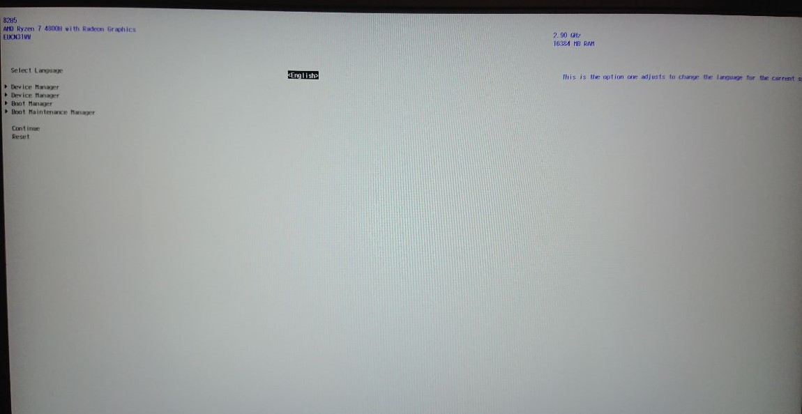
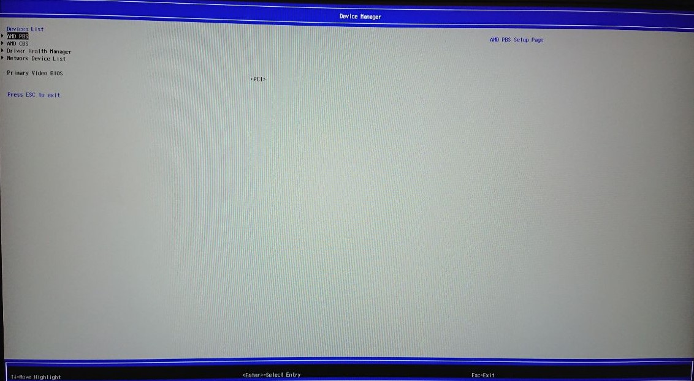
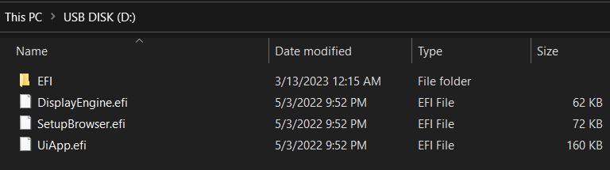

# Bios Flasher? Where We’re Going, We Don’t Need Bios Flasher?

## What this can do
With this tool you can Access and modify AMD PBS/AMD CBS Menu and possibly AMD Overclocking without flashing, and by just booting from a USB drive

## Disclaimer

I'm not responsible for any damage resulting from the use of this Tool, Also this is a backup of the original project;

USE AT YOUR OWN RISK

 **Using this tool you agree also to these rules**
 **Think twice before committing any change**
 **These are real bios settings treat them as such**
 **Not Evey option visable works or should be used**
 **These are even more true with the BETA version**

Changing setting could lead to brick, so handle with care, and be sure to have a method to recovery your device if things go wrong. For most options a bios clear is suitable however for some of the dangerous settings you might need a proper reflash which is why they are dangerous settings.

# Know Problem (Read This)
* Dell User have reported than the normal bios will not load anymore after using this :

    Fix Thank to (BIT_GAM3R and the Gaming [Laptop Mod Discord Comunity](https://discord.gg/FDgUR5cpCg)):
    
    Boot the Tool, access the BootManager, and delete the Misc Option, they should not be there, are created by a bug, if you tryed access the BootManager Before...
    Proper Fix will be pushed when ready
    
* Doesnt work on the 6000 series(Rembrant) versions of the Onexplayer, AOKZOE, and AYANEO devices

## Dangerous Setting
Know settings that will make your device brick - Note this primarily refers to the "locked" intergrated laptop/ handheld APUs rather than unlocked desktop APUs or CPUs
* P0State Vid 
* Curve Optimizer for certain APUs commonly unlocked 5000 series - however this can be done through windows using UXTU for all affected models

## How this work
AMD PBS/AMD CBS and possibly AMD Overclocking (Aod_Setup) export their HII database regardless of the manufacturer, so if we can load these we can access these menus without problem.

This package includes two main component a Loader and the UI component, the latter one are build from a standard edk2 Package.
On boot from usb the Loader will unregister the existing bios FormBrowser and will load this custom one, proving the new interface for this boot.

The only drawback of this method is that you need to boot from USB to accessed these menus.

## How to use it
Extract in a FAT32 USB, and boot from it, it will load the custom bios UI, Now if you enter Device Manager, AMD PBS/CBS will be there, you can modify what you want, and when done, just hit esc until it ask you to save.

On AMI Bios, in addition to AMD PBS and CBS will be shown also "Setup", this is the regular bios, the edit here might not be saved (AMD PBS/CBS, Aod Setup)

# Notable Options
* Ram Overclocking + Timings - Works on Picasso, Renior "U" and Luccine "U" apus up to 3200mhz, on Renior "H" apus up to 4400mhz, on Steam Deck.

    Might work on some Rembrant models, or CZN HX and HS apus with though the amd overclocking menu however all of these apus might have issues expect failure.
    Disabling gear down mode, power down mode, and setting the command rate seems to work on every apu

* UMA buffer size - works on all apus allows for different "Vram" amounts

* FCLK Control - Works for Renior H and might work for steam deck, CZN apus, and Rembrant apus.

* AMD Overclocking menu - Most settings that are in here should work if the menu appears for you

To have the best chance of talking to me or the creator of this tool this is the server to join [Isle of Zen](https://discord.gg/isle-of-zen-772105072720871435)

Reporting issues and asking about behavoir is best done there in #help-n-support

## Donate

If you want to donate/support please consider supportorting on:

[Patreon](https://www.patreon.com/SmokelessCPU)

BitCoin: bc1qv09hxpge9tv6zl74778un0x7t7fjlql8h3842r

ETH : 0xE0EaeA32a24c1559E17ba374FD004823B1fbB15B

note this goes to the original creator of this tool not me

# Anything that you feel should be included above let me know.

## Download
[UniversalAMDFormBrowser](UniversalAMDFormBrowser.zip)

## Photo

*T his should be how the usb should be set up fat32, with the folder you downloaded unzipped and placed into the root of the flash drive

